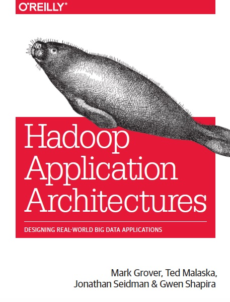

## Day One

Day one is `workshops` - half day tutorials.

Tom:
- Architecting a Data Platform
- Hadoop Application Architectures - Fraud Detection

Shannon:
- Building machine-learning apps with Spark: MLlib, ML Pipelines, and GraphX
- An introduction to time series with Team Apache

---

## Architecting a Data Platform

Delivered by Silicon Valley Data Science - link in description

Using ecosystem components to cater for `interactive`, `real-time` and `batch` workloads.

- Modern `Data Strategy`
- From `relational` to `specialised` (graph, document, K/V, columnar)
- Aquire -> Ingest -> Persistence -> Analytics -> Data Services
- `Experimental Enterprise` - accessible, support EDA and production systems

---

## Hierarchy of needs

  

---

## Hadoop Application Architectures - Fraud Detection

Use case - Network `anomaly detection`

Detect `deviations` from `known patterns`

- Ingestion = `Kafka` + `Flume`
- Event Processing = `Flume`
- Storage = `HBase` (with `BlockCache`)
- Stream Processing = `Spark Streaming`

---

  

---
## Building machine-learning apps with Spark: MLlib, ML Pipelines, and GraphX

Skimming the surface of `machine learning` at scale. 

A hands on tutorial going through small sample applications

- Linear Problems & Decision Trees with `Spark` and `MLlib`
- Clustering with `Spark` and `MLlib`
- K-means and LDA
- Recommendations with `Spark` and `MLlib` or `ML API`  
- Automated Least Squares (ALS)  
- Text Analytics with `PySpark` and `Zeppelin` notebook

---
## GraphX

  

---
## An introduction to time series with Team Apache

Datastax tutorial on using the `SMACK` stack for time series processing.

Emphasis on `Cassandra` architecture and using `Spark streaming`

- Ingestion = You guessed it: `Kafka` + `Spark streaming`
- Processing = `Spark streaming`
- Storage = `Cassandra`

---

## Tech Watch

  

--- .segue .dark

## Thanks!

