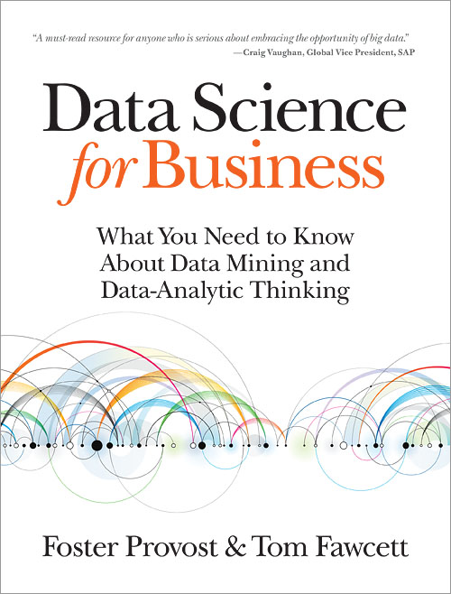

## Day Two

Day two is `sessions` - 40 minute talks. Also - developer showcase.

---
## Keynotes

8 back to back keynotes delivered by market leaders in the Data and Analytics space

Highlights:
- Megan Price (Human Rights Data and Analytics Group) Identifying individual deaths in Homs
- Ian Andrews (Pivotal) Peak BI
- Jenna Eggers (Nara Logics) Where we are with AI
- Alyosha Efros (UC Berkeley) Big Visual Data

---
## Big Data Business Strategy

You don't need a Big Data business strategy.

You need a business strategy that incorporates Big Data.

1. Identify business `initiatives`
2. Identify business `use cases`
3. Define `data` requirements
4. Develop `data science` plan
5. Define `technology` plan

---

<div style="text-align: center;">
  
</div>

---

## Streaming & Advanced analytics

Spark, Spark, Spark and Kafka

- Translate `process mining` algorithms into incrememental algorithms for `Spark`
- NoLambda - `SMACK` stack
- FiloDB - Low latency, in-memory, SQL database engine
- Time series - `Spark streaming` and new window functions in `DataFrames API`

---

## RecordService

Unified `authorisation` framework for Hadoop.

- Developed by Cloudera and open sourced under Apache licence
- File ACLs are not enough
- Provides row and column level role-based access control
- Works in conjunction with `Sentry` for policy definition

```
CREATE VIEW masked_info AS
SELECT mask(cc_number) AS ccn, name
FROM account_info WHERE region = “Europe"
```

---

## Governance and Uptime

SLAs and KPIs on Hadoop. 

Hadoop is bringing in many enterprise features: Erasure, Random read support. More and more like an online system

- SLAs are essential for certain use cases. Smart Grids, Fraud detection and Connected cars
- KPIs should be defined to track and audit data coming in and going out
- Centralised support instead of project based
- Geo located clusters
- Data locality dead?

---
## Dataviz

Implications of Design in visualisations

- Consistency, Density and Overlay are key to communicating data
- Subsets of the dimensions will drive the insight and intent
- Highlight a data point to intrigue the end user
- Perceived complexity is a challenge

--- .segue .dark

## Thanks!


